# Betreuungsbüro

**Die selbst gehostete Büroanwendung für rechtliche Betreuungen – Fallakte, Fristen,
Schriftgut, Kommunikation, Finanzen und Datenschutzdokumentation in einer Oberfläche.**

Rechtliche Betreuung ist Aktenarbeit unter Fristendruck: Für jede betreute Person laufen
Behördenanträge, Vermögenssorge, Berichte an das Gericht, Post, Termine und
Dokumentationspflichten nebeneinander. Betreuungsbüro bringt diese Arbeitsbereiche in einer
gemeinsamen Fallakte zusammen – einmal erfasst, überall verfügbar. Der Kern der Arbeit liegt aber
bei den Menschen: Selbstbestimmung sichern, Handlungsfähigkeit Schritt für Schritt zurückgeben,
einen Antrag gemeinsam durchgehen statt ihn still zu erledigen, erklären, wie ein Bescheid zu
lesen ist, und so lange begleiten, bis es allein gelingt. Diese Hilfe zur Selbsthilfe braucht vor
allem Zeit und einen freien Kopf. Genau dafür ist Betreuungsbüro gedacht: Die Verwaltung von
Fällen und Büro läuft verlässlich im Hintergrund mit, damit im Vordergrund Raum für das Gespräch
und die Begleitung bleibt.

Die Anwendung wird auf der eigenen Infrastruktur betrieben. Falldaten werden grundsätzlich
auf dem eigenen Server gespeichert; externe Dienste wie Mail, Kalender, Banking oder KI werden
nur genutzt, wenn sie ausdrücklich eingerichtet und aufgerufen werden.

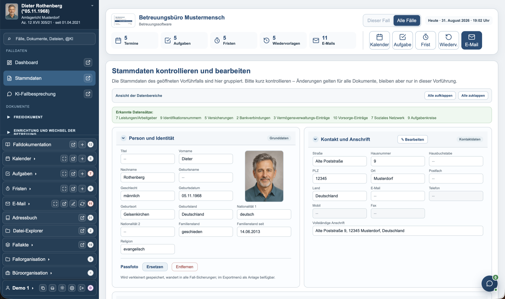

*Fallbezogene Stammdaten. Sämtliche abgebildeten Personen, Institutionen und Inhalte sind
fiktive Vorführdaten.*

## Was die Software macht

**Fallakte und Stammdaten.** Personen-, Kontakt- und Betreuungsdaten werden zentral gepflegt.
Zur Fallakte gehören unter anderem der Betreuungsverlauf, Wohnen, Gesundheit, Fähigkeiten,
Genehmigungen, Vermögen, Lebensunterhalt, Schuldenregulierung sowie Wünsche, Ziele und
Entscheidungen.

**Falldokumentation und Planung.** Notizen, Aufnahmen, Anlagen und Transkripte lassen sich mit
Terminen, Aufgaben, Fristen und Wiedervorlagen verbinden. Kalender können über CalDAV oder
ICS angebunden werden; weitere Aufgabenintegrationen sind vorbereitet.

**Schriftgut und Formulare.** Kuratierte Vorlagen decken typische Schreiben, Berichte,
Rechnungslegungen und Behördenanträge ab. Amtliche PDF-Vordrucke werden auf ihren
Originalseiten befüllt. Zusätzlich stehen ein Freidokument-Editor und Werkzeuge für eigene
Vordrucke zur Verfügung.

**Dokumentenablage.** Der integrierte Datei-Explorer ordnet Dokumente nach Fall und Sachgebiet.
PDFs können in einer Leseansicht durchsucht, kommentiert, markiert und mit Anmerkungen wieder
ausgegeben werden.

**E-Mail und Posteingang.** Mehrere Postfächer, fallbezogene Ablage, Anhänge, Entwürfe,
Versandhistorie und geschützter Dokumentenversand werden in der Anwendung zusammengeführt.

**Adressbuch.** Büro- und Fallkontakte können gefiltert, zusammengeführt und über vCard
importiert oder exportiert werden. Kontakte lassen sich direkt für Schreiben und Nachrichten
verwenden.

**Finanzen.** Die Anwendung umfasst Vergütungsabrechnung, Rechnungen, Zahlungsabgleich,
Fahrtkostennachweise, Controlling und Vermögenssorge. Eine Bankanbindung ist als gesondert
berechtigtes Modul vorgesehen.

**Datenschutz und Nachvollziehbarkeit.** Verzeichnis der Verarbeitungstätigkeiten, technische
und organisatorische Maßnahmen, Auskunftsersuchen, Datenpannen, Verarbeitungsprotokoll sowie
Aufbewahrungs- und Löschsteuerung sind Teil der Anwendung.

**Exporte und Sicherungen.** Arbeitsdaten können strukturiert als XLSX, ODS, CSV und JSON
ausgegeben werden. Vollständige, verschlüsselte Wiederherstellungsabbilder werden getrennt von
den Arbeitsdatenexporten behandelt. Vorführkonten und Vorführfälle sind von Arbeitsdatenexporten
und Sicherungsabbildern ausgeschlossen.

**Browser-Erweiterung „Formular-Assistent“.** Die Erweiterung überträgt ausgewählte Falldaten
in unterstützte Behörden-Webformulare. Vorgeschlagene Felder werden erst nach Auswahl befüllt;
Formulare werden niemals automatisch abgesendet. Der Quellcode liegt unter
[`extension/`](extension/), aktuelle Version: **0.5.0**.

**Super-Productivity-Plugin.** Das Plugin „Betreuungsbüro Sync“ bindet Aufgaben an Super
Productivity an. Quellcode und Dokumentation liegen unter
[`Super-Productivity-Plugin/`](Super-Productivity-Plugin/), aktuelle Version: **0.1.0**.

**Optionale KI-Unterstützung.** Formulierungshilfen, Dokumentenanalyse und Fallbesprechung
können mit einem selbst gewählten Anbieter genutzt werden. Anbieter, Modelle und persönliche
Prompt-Vorgaben werden in den Einstellungen verwaltet. Ohne eingerichteten KI-Zugang bleibt
die Anwendung nutzbar.

## Bildergalerie

<details>
<summary><strong>Weitere Ansichten der Anwendung öffnen</strong></summary>
<br>
<p>Zum Vergrößern auf ein Bild klicken. Alle dargestellten Inhalte sind fiktive Vorführdaten.</p>
<table>
  <tr>
    <td width="50%"><a href="docs/screenshots/01-dashboard.png">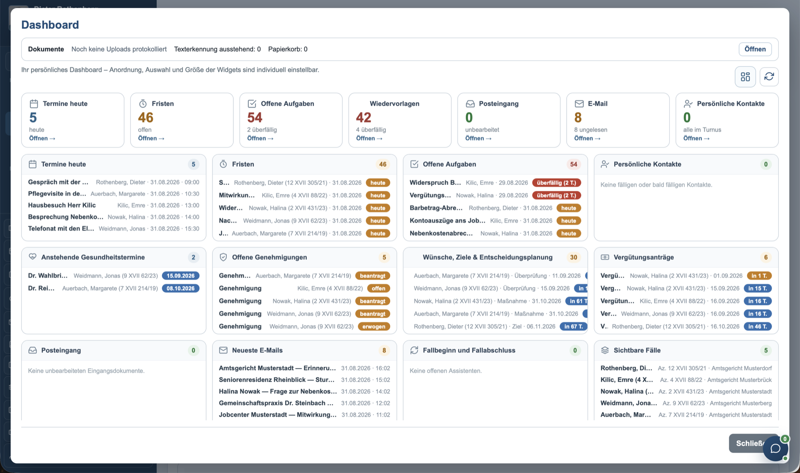</a><br><sub>Konfigurierbares Dashboard</sub></td>
    <td width="50%"><a href="docs/screenshots/00-freidokument.png">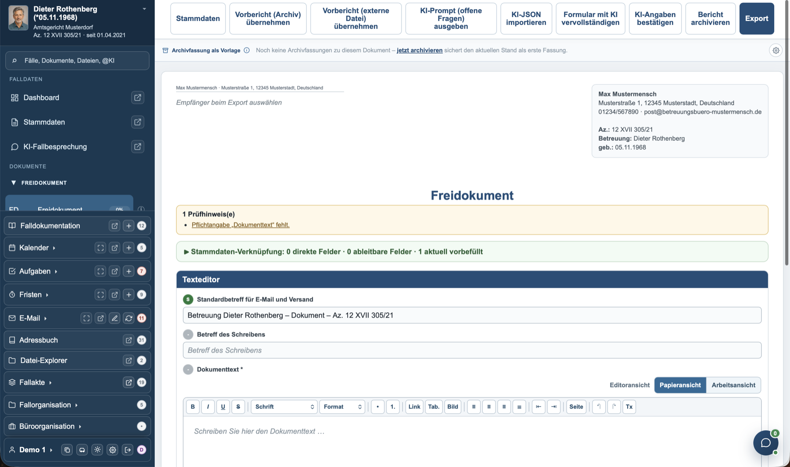</a><br><sub>Freidokument mit Fallbezug und Export</sub></td>
  </tr>
  <tr>
    <td><a href="docs/screenshots/03-kalender.png">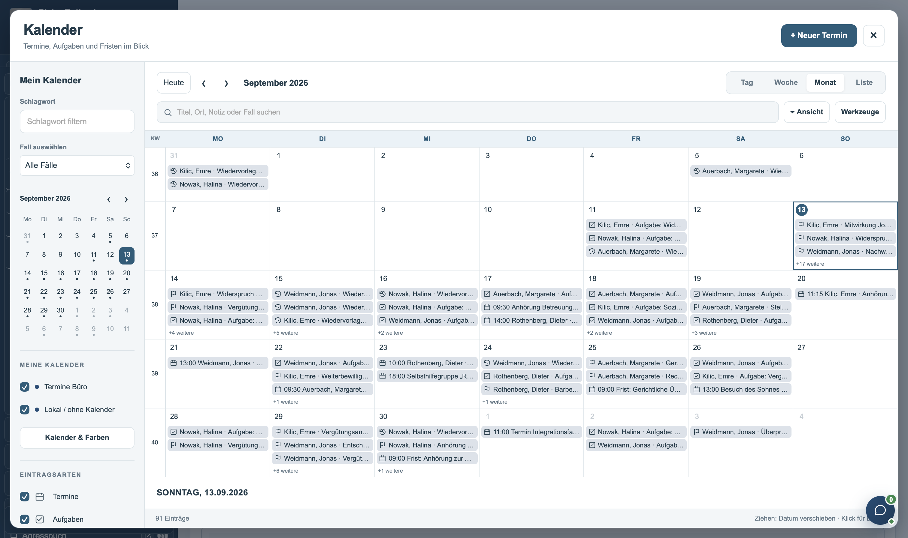</a><br><sub>Kalender, Termine und Wiedervorlagen</sub></td>
    <td><a href="docs/screenshots/04-e-mail-posteingang.png">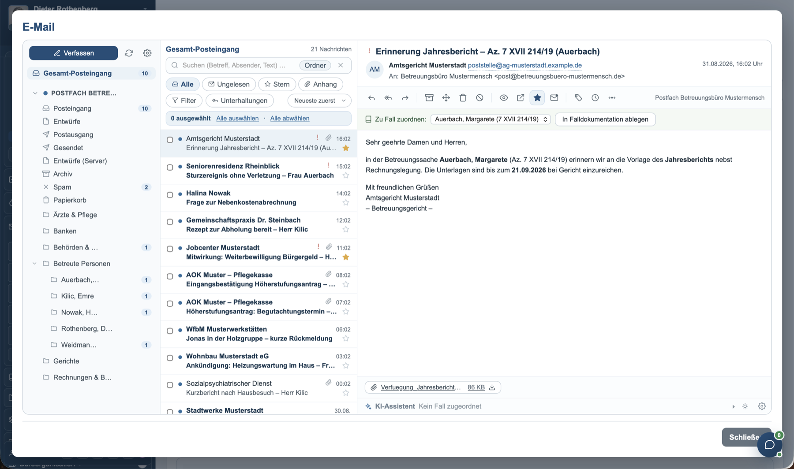</a><br><sub>E-Mail-Posteingang und Fallablage</sub></td>
  </tr>
  <tr>
    <td><a href="docs/screenshots/05-e-mail-verfassen.png">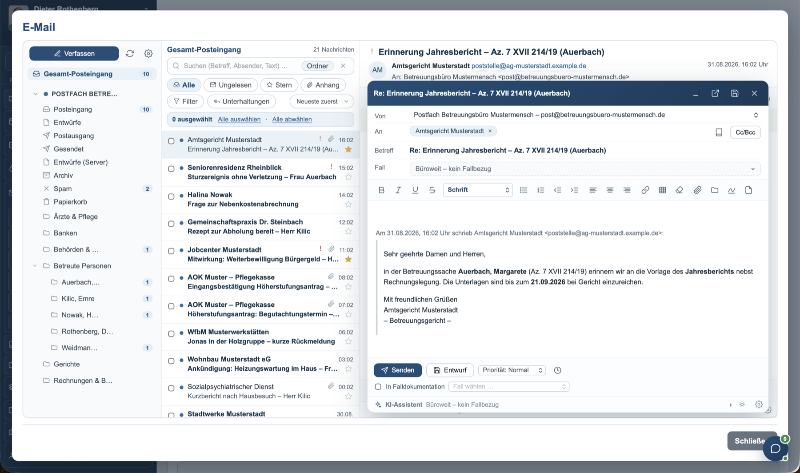</a><br><sub>E-Mail verfassen und beantworten</sub></td>
    <td><a href="docs/screenshots/06-datei-explorer.png">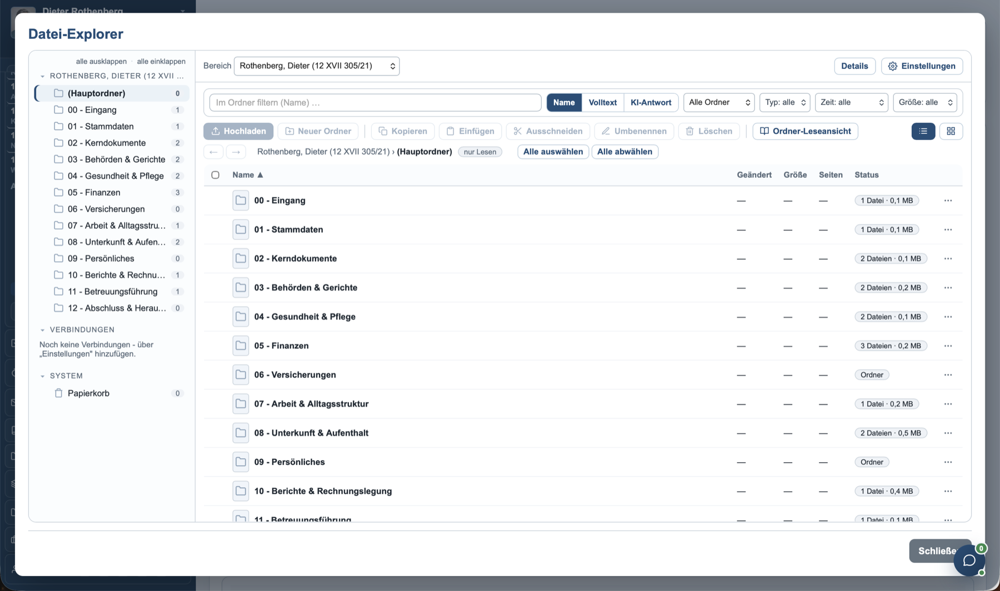</a><br><sub>Datei-Explorer mit Fallordnern</sub></td>
  </tr>
  <tr>
    <td><a href="docs/screenshots/07-datei-leseansicht.png">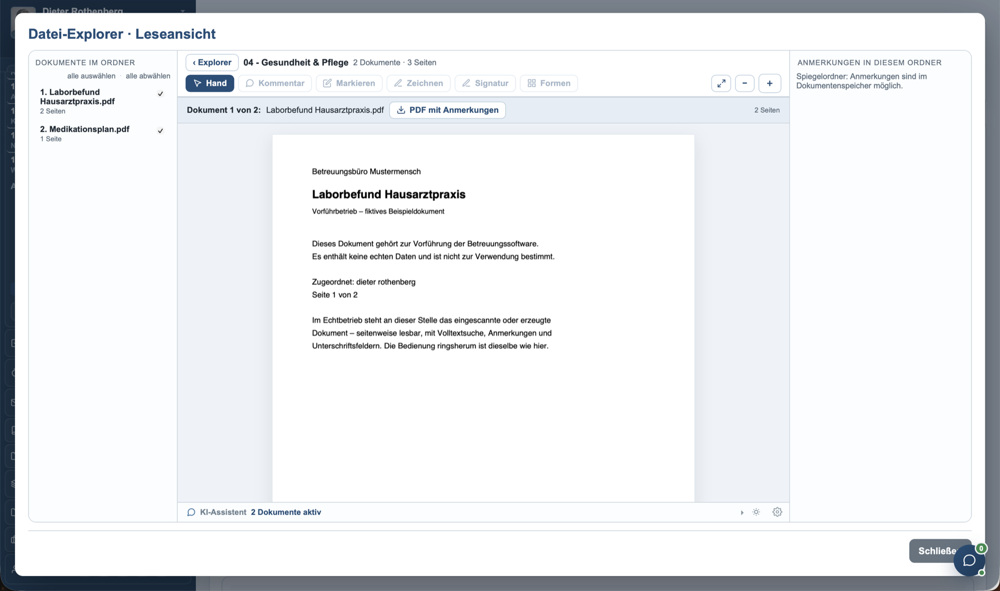</a><br><sub>PDF-Leseansicht und Anmerkungen</sub></td>
    <td><a href="docs/screenshots/08-adressbuch.png">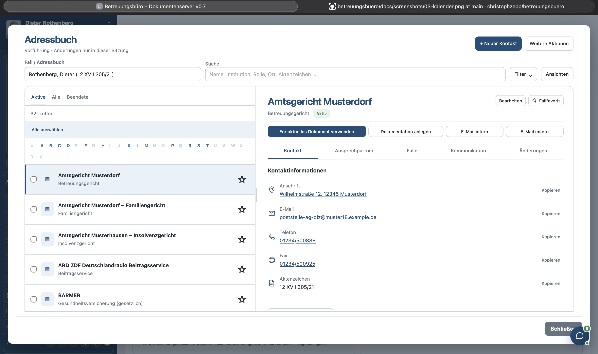</a><br><sub>Adressbuch und Kontaktexport</sub></td>
  </tr>
  <tr>
    <td><a href="docs/screenshots/09-falluebersicht.png">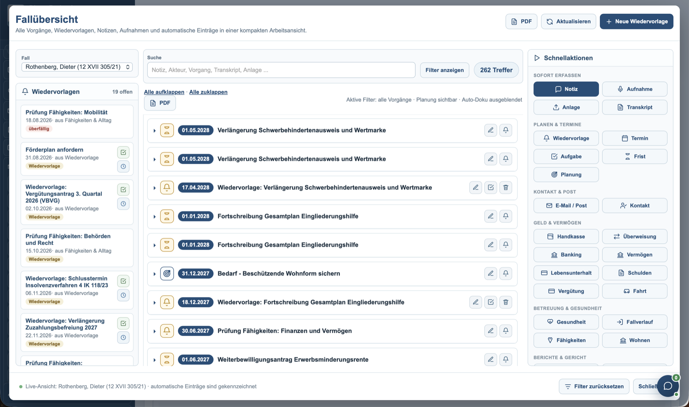</a><br><sub>Fallübersicht und Schnellaktionen</sub></td>
    <td><a href="docs/screenshots/10-banking.png">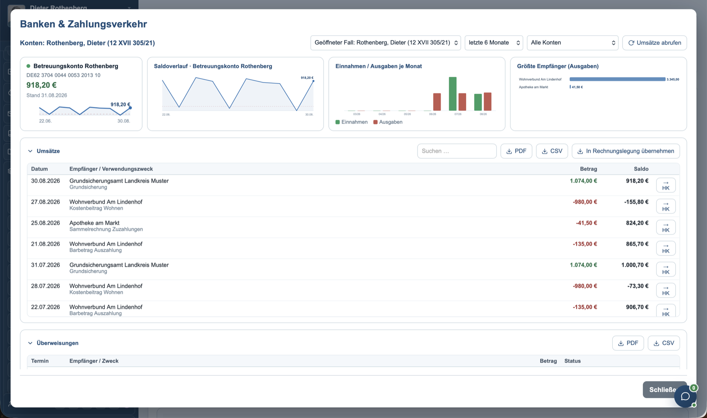</a><br><sub>Bankkonten und Zahlungsverkehr</sub></td>
  </tr>
  <tr>
    <td><a href="docs/screenshots/11-ziele-entscheidungsplanung.png"></a><br><sub>Wünsche, Ziele und Entscheidungsplanung</sub></td>
    <td><a href="docs/screenshots/12-einstellungen-herkunft.png">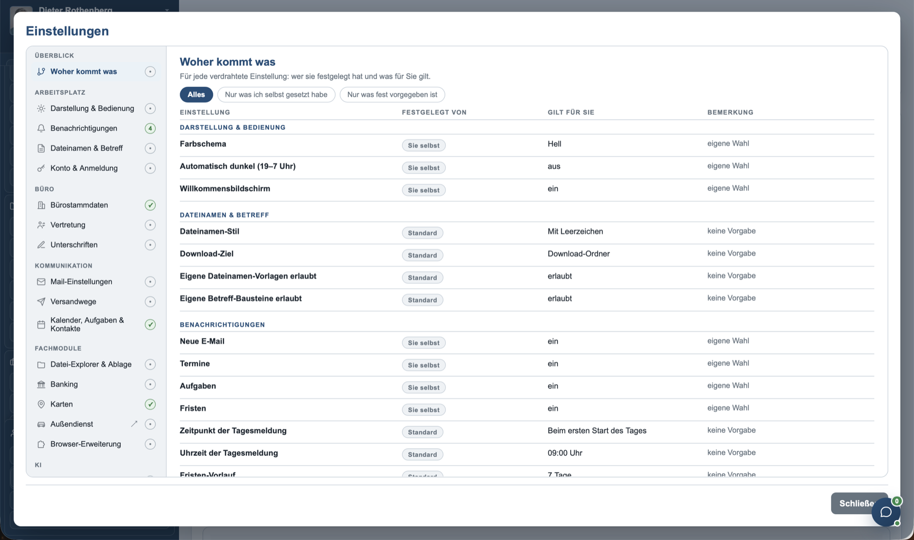</a><br><sub>Nachvollziehbare Einstellungsvorgaben</sub></td>
  </tr>
  <tr>
    <td><a href="docs/screenshots/13-buerostammdaten.png">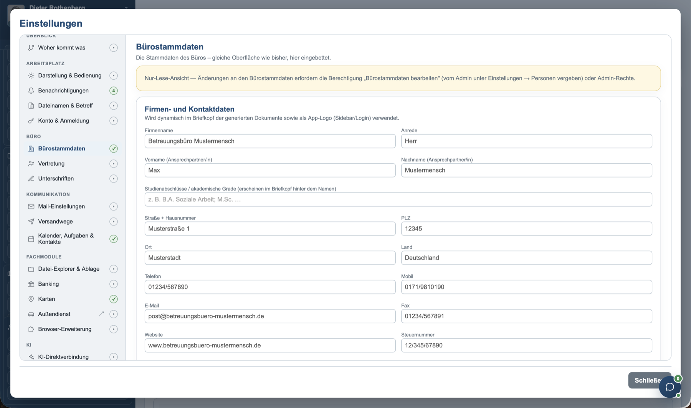</a><br><sub>Bürostammdaten und Berechtigungen</sub></td>
    <td><a href="docs/screenshots/14-ki-direktverbindung.png">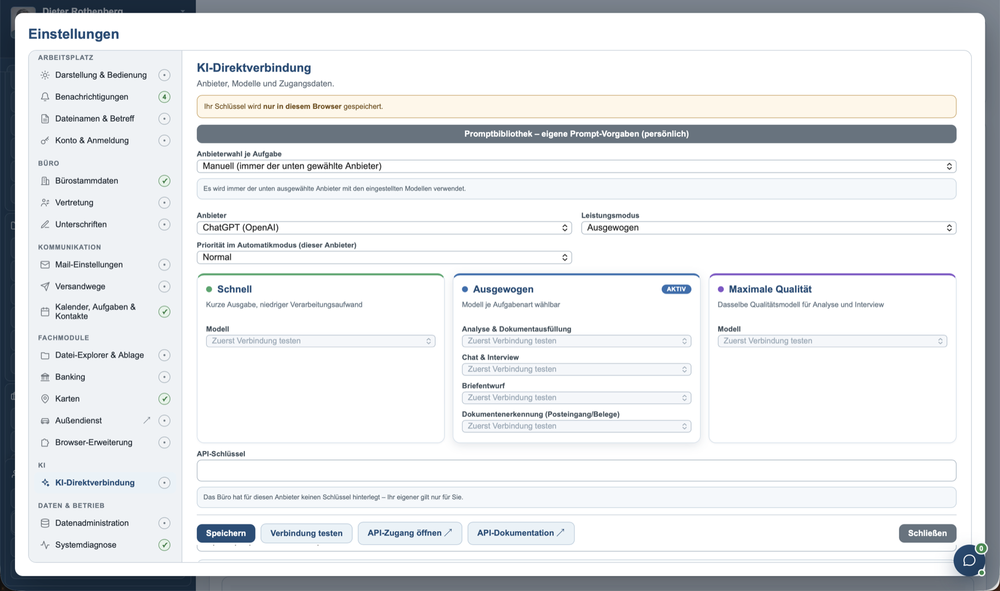</a><br><sub>KI-Anbieter und Modelle konfigurieren</sub></td>
  </tr>
  <tr>
    <td><a href="docs/screenshots/15-promptbibliothek.png">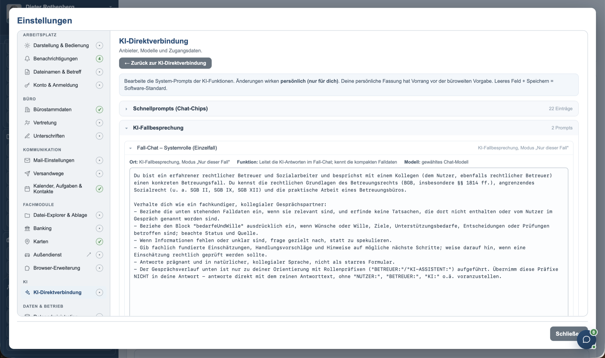</a><br><sub>Persönliche Promptbibliothek</sub></td>
    <td><a href="docs/screenshots/16-chat.png">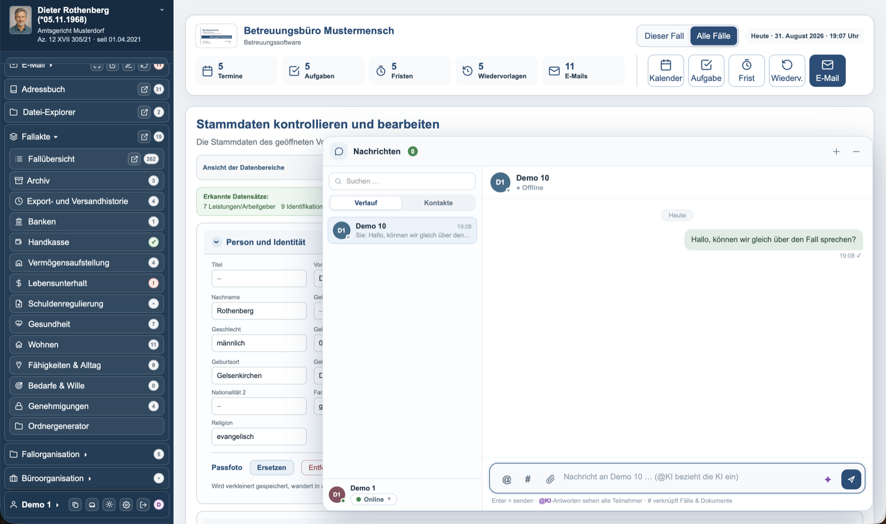</a><br><sub>Interner Chat mit Fall- und Dokumentbezug</sub></td>
  </tr>
</table>
</details>

## Betriebsarten

| Betriebsart | Zweck |
| --- | --- |
| **Online** | Mehrere Arbeitsplätze nutzen denselben Server und gleichen Änderungen in Echtzeit ab. |
| **Lokal** | Die Anwendung läuft als einzelne HTML-Datei; die Daten bleiben im jeweiligen Browser. |
| **Außendienst** | Ein verschlüsseltes Fallpaket wird für einen Außentermin mitgenommen und anschließend zurückgespielt. |
| **Demo** | Fiktive Vorführfälle werden getrennt von den Arbeitsdaten bereitgestellt. |

Die Berechtigungen werden serverseitig kontrolliert und getrennt für Lokal- und Online-Modus
verwaltet. Administrative Funktionen und besonders sensible Module wie Banking,
Zugangsdatenverwaltung oder büroweite Einsicht besitzen eigene Rechte.

## Demo-Zugangsdaten

Der Demo-Modus muss zunächst durch eine Administratorin oder einen Administrator freigeschaltet
werden. Danach stehen zwei Reihen bewusst öffentlicher Vorführkonten zur Verfügung:

| Rolle | Benutzernamen | Kennwörter | Beispiel |
| --- | --- | --- | --- |
| Mitarbeitende | `Demo1` bis `Demo20` | `Demopasswort1` bis `Demopasswort20` | `Demo1` / `Demopasswort1` |
| Administration | `DemoAdmin1` bis `DemoAdmin20` | `DemoAdminPasswort1` bis `DemoAdminPasswort20` | `DemoAdmin1` / `DemoAdminPasswort1` |

Die Ziffer im Benutzernamen und Kennwort muss jeweils übereinstimmen. Diese Zugangsdaten sind
ausschließlich für den isolierten Vorführmodus vorgesehen und dürfen nicht für echte Konten
verwendet werden. Demo-Konten sehen keine echten Konten; Vorführfälle werden nur für die
Demo-Sitzung bereitgestellt und nicht in Arbeitsdatenexporte übernommen.

## Technischer Aufbau

```text
server/                       Node.js/Express-Server, Fachmodule und Integrationen
  assets/                     Vorlagen und statische Laufzeitbestandteile
  src/                        Servermodule, Rechteprüfung und Schnittstellen
  tools/                      PDF-Overlay, Sicherung, Kuratierung und Wartung
  tests/                      automatisierte Prüfstände
outputs/                      ausgelieferte Web-App als einzelne HTML-Datei
extension/                    Browser-Erweiterung „Formular-Assistent“
Super-Productivity-Plugin/    Plugin „Betreuungsbüro Sync“
docs/screenshots/             Bilder für diese README
compose.yaml                  Docker-Compose-Konfiguration
Dockerfile                    Container-Build
```

Laufzeitdaten wie Datenbanken, Dokumentenspeicher, Exporte, Sitzungen, Zugangsdaten,
Recovery-Dateien und echte `.env`-Dateien gehören ausdrücklich **nicht** in GitHub und nicht in
das Container-Image.

## Veröffentlichungskanäle

| Kanal | Container-Image | Zweck |
| --- | --- | --- |
| Beta | `ghcr.io/christophzepp/betreuungsbuero-beta:beta` | Interne Vorabversionen aus `develop` |
| Stable | `ghcr.io/christophzepp/betreuungsbuero:stable` | Freigegebene Versionen |

Änderungen am Branch `develop` erzeugen automatisch ein neues Beta-Image. Ein Versions-Tag wie
`v0.8.0` erzeugt ein Stable-Image mit den Tags `stable`, `0.8.0` und `0.8`. Beide Images werden
für `linux/amd64` und `linux/arm64` gebaut und vor der Veröffentlichung durch einen
Container-Starttest geprüft.

## Installation mit Docker Compose

### 1. Konfigurationsdateien vorbereiten

`compose.yaml` und `.env.example` in einen eigenen Installationsordner kopieren. Anschließend
`.env.example` als `.env` speichern.

### 2. Geheimnisse erzeugen

Für `SESSION_SECRET`, `ENCRYPTION_KEY` und `SETUP_TOKEN` jeweils einen eigenen Zufallswert
erzeugen und in `.env` eintragen:

```bash
openssl rand -hex 32
```

Für eine freigegebene Version wird dieses Stable-Image verwendet:

```dotenv
APP_IMAGE=ghcr.io/christophzepp/betreuungsbuero:stable
```

Für den privaten Beta-Kanal kann stattdessen das Vorab-Image eingestellt werden:

```dotenv
APP_IMAGE=ghcr.io/christophzepp/betreuungsbuero-beta:beta
```

### 3. Container-Image abrufen

Das Stable-Image öffentlicher Releases kann ohne Anmeldung abgerufen werden. Nur für den
privaten Beta-Kanal muss Docker einmalig mit einem dafür berechtigten GitHub-Token an der
GitHub Container Registry angemeldet werden:

```bash
docker login ghcr.io
```

### 4. Anwendung starten

```bash
docker compose pull
docker compose up -d
```

Ohne abweichende Konfiguration ist die Anwendung anschließend unter
<http://localhost:8935> erreichbar.

## Aktualisierung

```bash
docker compose pull
docker compose up -d
```

`pull_policy: always` sorgt dafür, dass Docker Compose beim Start das aktuelle Image des
gewählten Kanals prüft. Ein bereits laufender Container wird nicht ohne einen erneuten
Compose-Aufruf ausgetauscht.

## Persistente Daten und Sicherung

Docker verwaltet getrennte Volumes für:

- Anwendungszustand, Datenbank und Dokumentenspeicher,
- Recovery-Schlüssel,
- Sicherungen und
- Wiederherstellungsstatus.

Ein Docker-Volume ist noch keine externe Sicherung. Für den dauerhaften Betrieb muss zusätzlich
ein unabhängiges Sicherungsziel auf einem getrennten Datenträger oder System eingerichtet
werden. Sicherungen sollten regelmäßig auf einer getrennten Installation testweise
wiederhergestellt werden.

Nach der Erstinstallation ist im Administrationsbereich ein Recovery-Schlüssel einzurichten.
Erst damit können vollständige verschlüsselte Wiederherstellungsabbilder erzeugt werden.

## Reverse Proxy und große Übertragungen

Läuft die Anwendung hinter einem Reverse Proxy oder Tunnel, können dort Größen- und Zeitlimits
gelten. Große Gesamtimporte, Außendienst-Rückspielungen und serverseitig erzeugte
Gesamtsicherungen sollten deshalb über eine direkte, geschützte Verbindung zum Anwendungsserver
ausgeführt werden.

Läuft ein Tunnel selbst als Container, werden Anwendung und Tunnel an ein gemeinsames externes
Docker-Netz angeschlossen. Das interne Ziel lautet dann `http://betreuungsbuero:8935`.

## Datenschutz und Sicherheit

Die Software verarbeitet Gesundheits-, Vermögens- und Behördendaten besonders
schutzbedürftiger Menschen. Wesentliche Grundsätze sind:

- **Selbst gehostet:** Die zentrale Datenhaltung liegt auf der Infrastruktur des Büros.
- **Verschlüsselte Übergabe:** Sicherungen und Außendienstpakete werden verschlüsselt.
- **Nachvollziehbarkeit:** Verarbeitungsprotokoll, Datenschutzverwaltung und
  Wiederherstellungsprüfung sind Teil der Anwendung.
- **Getrennte Rechte:** Funktionen werden nicht nur in der Oberfläche ausgeblendet, sondern an
  den Serverzugriffen geprüft.
- **Bewusste externe Verbindungen:** Mail-, Kalender-, Banking-, Karten- und KI-Dienste werden
  erst nach ausdrücklicher Einrichtung verwendet.
- **Kein automatisches Absenden:** Die Browser-Erweiterung befüllt ausgewählte Felder, löst aber
  keine verbindlichen Absendeschritte aus.
- **Keine Laufzeitdaten im Repository:** Datenbanken, Dokumente, Schlüssel und echte
  Konfigurationsdateien werden von Git und vom Container-Build ausgeschlossen.

Die Anwendung befindet sich in Entwicklung und ersetzt keine rechtliche, technische oder
datenschutzrechtliche Prüfung der konkreten Installation.

## Lizenz

Copyright (C) 2026 christophzepp — **GNU Affero General Public License v3 oder später**
(`AGPL-3.0-or-later`), vollständiger Text in [`LICENSE`](LICENSE).

Selbst hosten, prüfen und verändern ist ausdrücklich erlaubt. Wer die Software Dritten über ein
Netzwerk zugänglich macht, muss ihnen den Quelltext der betriebenen Fassung anbieten (§ 13
AGPL). Für eine Nutzung unter anderen Bedingungen ist eine kommerzielle Lizenz möglich —
Einzelheiten in [`NOTICE.md`](docs/lizenzen/NOTICE.md).

**Nicht von der Lizenz erfasst:** die amtlichen Vordrucke unter
`server/tools/pdf-overlay/vorlagen/` (Herkunft in
[`VORDRUCKE.md`](docs/lizenzen/VORDRUCKE.md)) und die Software Dritter
([`THIRD-PARTY.md`](docs/lizenzen/THIRD-PARTY.md)).
