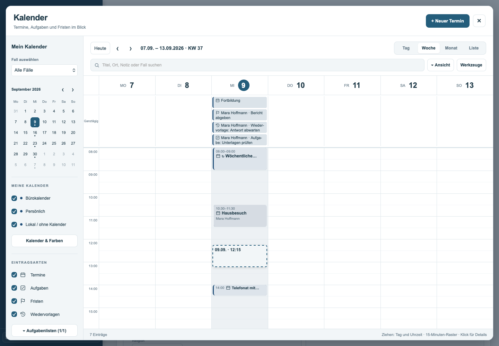
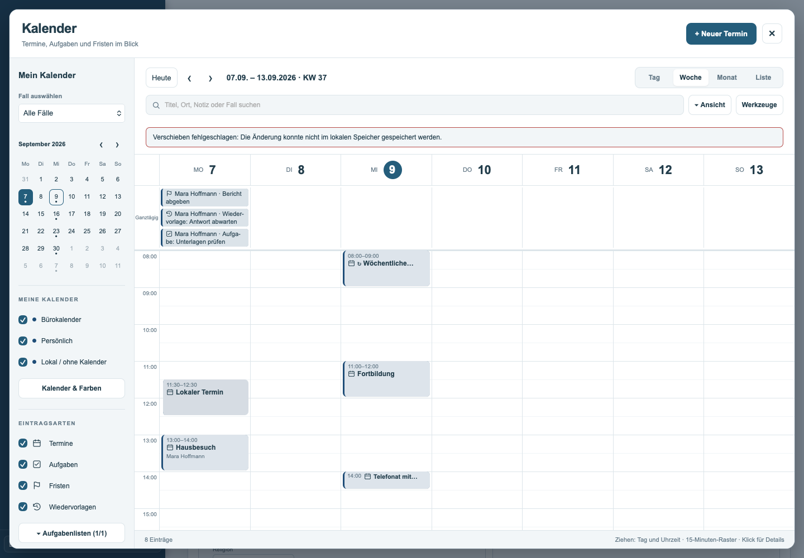

Kalender: Drag-and-drop-Korrekturen vom 09.09.2026

Auf Basis von `7beb495` umgesetzt und für den Beta-Kanal (`develop`) freigegeben. `main` bleibt unverändert.

Beim Ablegen wurden Aufgaben, Fristen und Wiedervorlagen bisher ausschließlich in der Terminablage gesucht und deshalb still verworfen. Auch numerische lokale Kennungen wurden beim Vergleich mit der Zeichenkette aus dem Ziehvorgang nicht gefunden. Lokale Speicherfehler wurden verschluckt. Diese Wege sind korrigiert: Der passende Eintrag wird aktualisiert, der Schreibvorgang geprüft und ein Fehler unmittelbar im Kalender angezeigt.

Ein einfacher Ziehvorgang mit einem regulären Termin ließ sich im Ausgangsstand in Chromium und WebKit bereits erfolgreich speichern. Der vollständige Ausfall des konkreten Safari-Vorgangs aus dem Screenshot konnte damit nicht eindeutig reproduziert werden. Die neuen Prüfungen decken die nachgewiesenen Fehler sowie Datum und Uhrzeit, gescrollte Raster und den echten Demo-Arbeitsspeicher ab.

Im Tages- und Wochenraster verwenden Vorschau und Speicherung dieselbe Berechnung in 15-Minuten-Schritten. Die Greifposition bleibt erhalten. Laufende Hintergrundaktualisierungen ersetzen das Raster während des Ziehens nicht. Andere Einträge verdecken das Ablegeziel nicht; das gezogene Element selbst bleibt für Safari als Ziehquelle aktiv. Nach dem Ablegen bleiben die Scrollpositionen erhalten. Abbruch entfernt Vorschau und Hervorhebung vollständig.

Termine behalten Dauer und Erinnerungsabstand. Beim Verschieben im Monatsraster bleibt zusätzlich die Uhrzeit erhalten. Wird ein ganztägiger Termin auf eine Uhrzeit gezogen, entsteht ein einstündiger Termin; die Vorschau zeigt diese Dauer. Aufgaben, Fristen und Wiedervorlagen bleiben im Kalender Datumsangaben und behalten ihre bestehenden Fälligkeitszeiten, Erinnerungen und Verknüpfungen. Bestehende Einschränkungen beim Ziehen von Serien und Mehrtagesterminen bleiben bestehen.

| Prüfung | Ergebnis |
| --- | --- |
| Echte Mausbewegungen in WebKit | 19 bestanden |
| Echte Mausbewegungen in Chromium | 19 bestanden |
| Bestehende Desktop-Abläufe | 36 bestanden |
| Bestehende mobile Abläufe | 59 bestanden |
| Gezielte Kalender-Unit-Tests | 35 bestanden |
| Datum-/Ortsausrichtung, WebKit | 9 bestanden |
| Schlagwortsuche und Demo-Beschriftung, WebKit | 5 bestanden |
| Gesamt | 182 bestanden |

Zusätzlich steht die Schlagwortsuche jetzt direkt unter „Mein Kalender“. Der Demo-Modus erklärt ausdrücklich, dass Änderungen nur in dieser Sitzung bestehen. In den Termindetails stehen Kalender- und Orts-Icon samt Text bündig untereinander, auch bei langen Datumsangaben und schmalen Fenstern.

Die Browserprüfungen verwenden die ausgelieferte HTML-Anwendung mit ausschließlich synthetischen Daten und abgefangenen Serveranfragen. Die lokalen Tests verwenden die tatsächliche Demo-Speicherimplementierung der Anwendung. Persistenz wird durch Lesen der gespeicherten Datensätze und erneutes Öffnen des Kalenders geprüft. Ein vollständiges Neuladen der Seite setzt Demo-Daten weiterhin absichtlich zurück.

Protokolle und Screenshots liegen im Ordner [kalender-drag-drop-v3](kalender-drag-drop-v3/). In der Anwendungsdatei wurden ausschließlich die beiden Kalenderblöcke geändert; der vorhandene Binärinhalt blieb erhalten.

