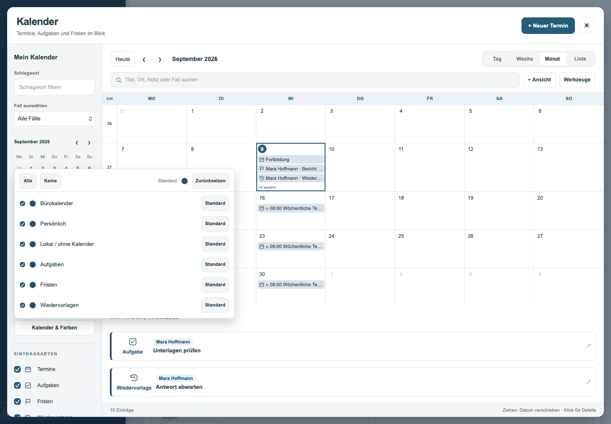
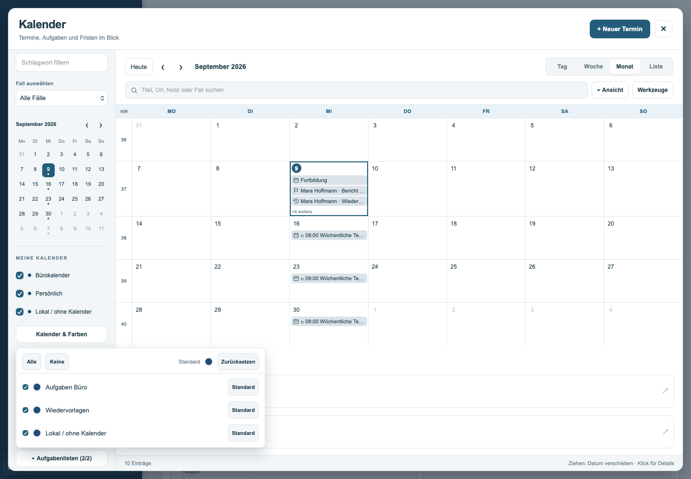

# Kalender-Pop-ups: Positionierung vom 09.09.2026

Aufgabenlisten und „Kalender & Farben“ konnten am unteren Rand des Fensters abgeschnitten werden. Die vorherige Desktop-Positionierung öffnete stets unterhalb des Buttons und erzwang mindestens 160 Pixel Höhe. In WebKit wurde der Fehler am Ausgangsstand reproduziert: Unterkante des Menüs bei 1139 Pixeln in einem 1000 Pixel hohen Fenster.

Die gemeinsame Positionierung für Aufgabenlisten, Kalender & Farben und Ansicht vergleicht nun den verfügbaren Platz oberhalb und unterhalb des Buttons. Bei Platzmangel öffnet das Menü nach oben. Breite und Höhe bleiben innerhalb des sichtbaren Kalenderfensters; lange Listen sind intern scrollbar. Beim Scrollen der Seitenleiste folgt das Menü seinem Button. Verlässt der Button den sichtbaren Bereich, schließt das Menü. Fenster- und Sichtbereichsänderungen lösen eine Neuberechnung aus. Beim Anwenden von Filtern bleibt die Position der Seitenleiste erhalten.

## Prüfung

- WebKit: 14 Popup-Prüfungen bestanden.
- Chromium: 14 Popup-Prüfungen bestanden.
- Bestehende Desktop-Abläufe in Chromium: 36 Prüfungen bestanden.
- Gezielte Kalender-Unit-Tests: 36 Prüfungen bestanden.
- Syntax und Änderungsformat geprüft; in der Anwendung ausschließlich Kalender-Script und Kalender-CSS geändert. Vorhandener Binärinhalt unverändert.

Die Popup-Prüfungen verwenden die ausgelieferte Anwendung mit synthetischen Daten und abgefangenen Serveranfragen. Sie prüfen beide betroffenen Menüs, die Öffnungsrichtung, kontrollierte Scrollpositionen, Fenster von 320×480 bis 1440×1000, lange Listen sowie „Alle“/„Keine“. Die Screenshots wurden visuell geprüft.

Die zusätzlich versuchte allgemeine Desktop-Suite in WebKit bricht beim automatischen Leeren des Erinnerungsfeldes in der Termin-Neuanlage ab: Das leere Feld wird vom Testbrowser als ungültig gemeldet. Derselbe Fehler wurde mit dem unveränderten Ausgangsstand 6fd8ae7 reproduziert; er ist keine Folge der Popup-Korrektur. Das Protokoll liegt als `webkit-bestandsvergleich.txt` bei. Die gezielten Popup-Prüfungen in WebKit sind davon nicht betroffen.

Die Änderung basiert auf `6fd8ae7` und wurde vom Nutzer für den Beta-Kanal (`develop`) freigegeben. `main` bleibt unverändert.

