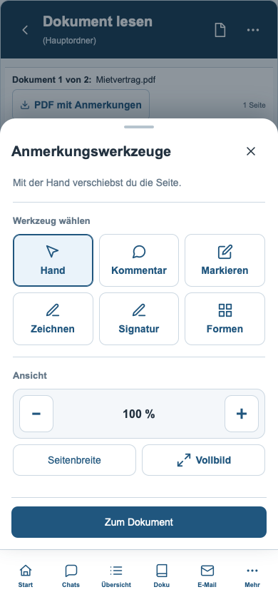
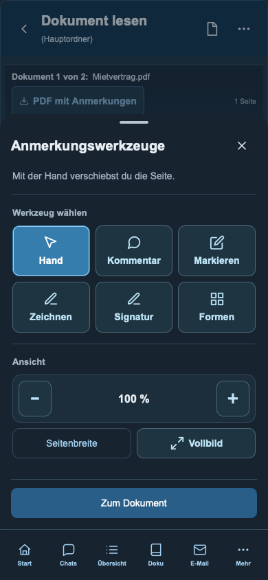
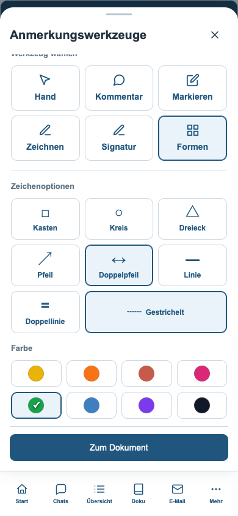
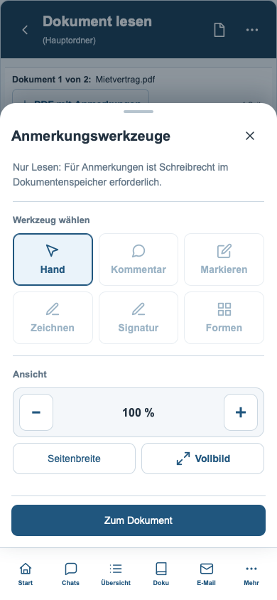

# Mobile Anmerkungswerkzeuge im Dokumentenleser

Stand: 09.09.2026. Grundlage: Beta `b4dfffc`. Umsetzung für den Beta-Zweig `develop`.

Das Werkzeugblatt übernimmt die vorhandenen Reader-Aktionen in eine mobile Aufteilung. Die doppelte Explorer-Navigation und Ordnerzeile entfallen im Blatt; der Kontext bleibt in der Kopfzeile des Dokumentenlesers erhalten.

- Sechs gleich große Werkzeugflächen in einem Raster mit drei Spalten: Hand, Kommentar, Markieren, Zeichnen, Signatur, Formen.
- Sichtbare Auswahlzustände, beschriftete Werkzeuge und Touchflächen von mindestens 44 Pixeln.
- Markieren, Zeichnen und Formen lassen das Blatt für die Farb- und Formauswahl geöffnet. Sieben Formen, gestrichelte Linien und acht Farben bleiben kombinierbar.
- Die eigene Ansichtsgruppe enthält Verkleinern, Vergrößern, eine Prozentanzeige, Seitenbreite und Vollbild. 100 % entspricht der mobilen Ausgangsbreite der Seite.
- „Zum Dokument“ bleibt unter dem scrollbaren Blattinhalt erreichbar. Hand, Kommentar und Signatur führen nach der Auswahl direkt zurück zum Dokument.
- Reine Leseberechtigung wird erklärt; die fünf Schreibwerkzeuge bleiben deaktiviert.

Zusätzlich behoben: Der bisherige Zoom begrenzte die Mindestbreite auf 460 Pixel. Dadurch konnte „Verkleinern“ eine schmale mobile Seite zunächst vergrößern. Mobil liegt die Untergrenze jetzt bei 240 Pixeln; die Desktop-Grenze bleibt unverändert.

## Ansichten aus der ausgeführten App

## Prüfung

| Prüfung | Erfolgreich |
|---|---:|
| Werkzeuge, Layout und PDF-Abläufe in WebKit | 34 |
| Werkzeuge, Layout und PDF-Abläufe in Chromium | 34 |
| Bestehende mobile Explorer-Abläufe in WebKit | 57 |
| Bestehende Explorer-/Dokumenteigenschaften-Codeprüfungen | 22 |
| Syntax ausführbarer Inline-Skripte | 229 |

Die Browserprüfungen laden die ausgelieferte HTML-App mit dem echten PDF-Renderer, synthetischen Dokumenten und abgefangenen APIs. Sie prüfen das Speichern einer farbigen gestrichelten Form, Auswahl und Platzierung einer Signatur sowie Kommentare. Die bestehende Explorer-Prüfung deckt unter anderem fehlgeschlagene Speichervorgänge, Entwurfsschutz, Upload, Download, Navigation und Leserechte ab.

Visuell geprüft: 320, 390 und 570 Pixel Breite in Hell und Dunkel sowie ein kurzes Display mit 320 × 568 Pixeln. Bei Platzmangel scrollt der Blattinhalt, während Kopf und Abschluss erhalten bleiben. Die Desktop-Werkzeugleiste wurde ebenfalls geprüft. WebKit wurde automatisiert getestet, kein physisches iPhone.

Alle 99 eingebetteten Zeichenblöcke mit mindestens 1.000 Zeichen und das vorhandene NUL-Byte sind gegenüber `b4dfffc` unverändert. Protokolle liegen unter [Prüfungen](mobile-lesewerkzeuge-v7/pruefungen/).

Reproduktion: `server/scripts/qa-mobile-reader-tools.cjs` und `server/scripts/qa-mobile-explorer.cjs` mit `PLAYWRIGHT_MODULE`, `MOBILE_QA_BROWSER` und `MOBILE_QA_OUTPUT`.
