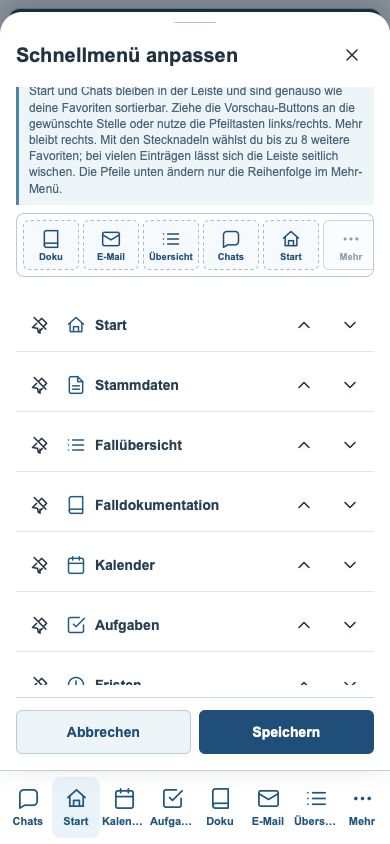
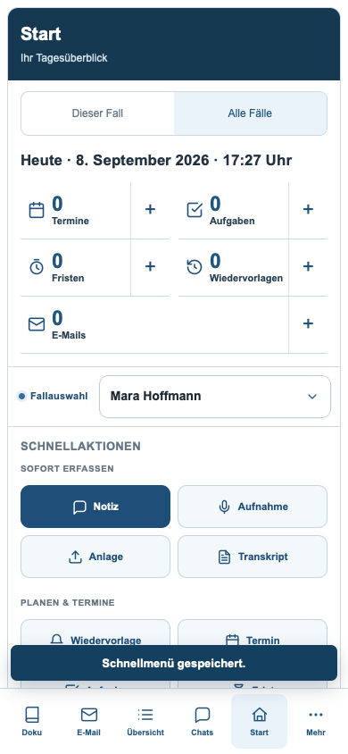
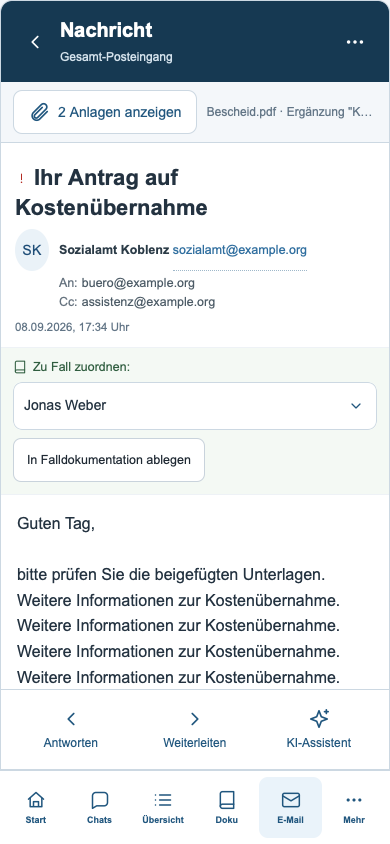
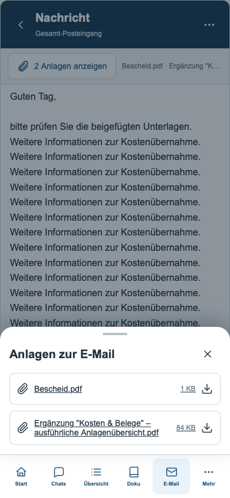

# Mobile Sortierung und Mail-Anlagen

Stand: 08.09.2026. Grundlage: veröffentlichte Beta `2a88fe8`. Veröffentlichung dieser Korrekturen über den Beta-Kanal `develop` und dessen Docker-Workflow.

## Start und Chats sortieren

Start und Chats bleiben angeheftet, haben aber keine feste Position mehr. In „Mehr → Menü anpassen“ lassen sie sich in der Vorschau wie die anderen Zugänge ziehen oder per Pfeiltasten links/rechts verschieben. Nur Mehr bleibt rechts. Bis zu acht zusätzliche Favoriten sind weiterhin möglich; bei Platzmangel lässt sich die Reihe seitlich wischen.

Die gemeinsame Reihenfolge wird lokal und in den Benutzereinstellungen gespeichert. Vorhandene Favoriten bleiben erhalten. Ältere Start-/KI-Fallchat-Pins werden in die neue Reihenfolge übernommen; aus dem KI-Fallchat-Pin wird Chats. Abbrechen verwirft die Vorschauänderungen. Mitarbeiterchat-Badge und Entwurfsschutz bleiben erhalten.

## Anlagen sofort erkennen und erreichen

Nachrichten mit Anlagen zeigen direkt unter der mobilen Kopfzeile einen Zugang mit Anzahl und Dateinamen. Dieser bleibt beim Scrollen sichtbar. Antippen öffnet ein mobiles Blatt mit vollständigen Dateinamen, Größen und den bestehenden Downloadlinks. Die Leseposition bleibt beim Schließen erhalten. Nachrichten ohne Anlagen zeigen keine zusätzliche Leiste.

Die Dateiliste am Ende der Nachricht bleibt erhalten. Es werden ihre vorhandenen Links wiederverwendet, einschließlich Konto, Ordner, Nachrichten-ID, Anlagenindex und Dateiname. HTML-Nachrichten behalten ihre Sandbox. Der Desktop erhält keine zusätzliche Anlagenleiste.

## Prüfung

| Prüfung | Erfolgreich |
|---|---:|
| Mobile Code-Tests | 205 |
| Menü und gespeicherte Sortierung – WebKit / Chromium | 105 / 105 |
| Anlagen, echte Downloads, Nachrichtenwechsel – WebKit / Chromium | 19 / 19 |
| Bestehende Mail-Abläufe – WebKit | 53 |
| Gemeinsames mobiles Fundament – WebKit | 27 |
| Scroll- und Tastaturverhalten – WebKit | 24 |
| Ausführbare Inline-Skripte: Syntax | 229 |

Insgesamt 352 erfolgreiche Browserprüfungen. Echte Drag-Gesten für Start und Chats, Tastatursortierung, Speichern und erneutes Laden wurden geprüft. Die Anlagenliste wurde bei 320, 390 und 570 Pixeln Breite in Hell und Dunkel geprüft. Der Downloadtest lädt eine synthetische Datei über einen lokalen Testserver und vergleicht Inhalt, Dateiname und angeforderte Anlage. Alle 99 eingebetteten Datenblöcke und das vorhandene NUL-Byte sind unverändert.

Die Prüfungen nutzen die ausgelieferte HTML-App, simulierte Konten und Falldaten sowie abgefangene APIs. Download-Dateien stammen ausschließlich vom lokalen Testserver. WebKit ist eine automatisierte Browserprüfung und ersetzt keinen Test auf einem physischen iPhone.

Protokolle liegen im [Prüfungsordner](mobile-sortierung-anlagen-v6/pruefungen/). Reproduktion über `server/scripts/qa-mobile-menu.cjs`, `qa-mobile-mail-attachments.cjs`, `qa-mobile-mail.cjs`, `qa-mobile-foundation.cjs` und `qa-mobile-navigation.cjs`, jeweils mit `PLAYWRIGHT_MODULE`, `MOBILE_QA_BROWSER` und `MOBILE_QA_OUTPUT`.

## Ergänzung: Briefanrede im sozialen Netzwerk

Das Anrede-Feld im sozialen Netzwerk und seine Entsprechung im Posteingang verwenden jetzt `ab_salutation`, dieselbe gepflegte Briefanrede-Liste wie das Falladressbuch. Die automatische Stammdaten-Erweiterung überschreibt diese Zuordnung nicht mehr mit der Personenanrede `sd_anrede`. Bestehende Werte, freie Eingaben und eigene Bürovorschläge bleiben erhalten.

Zusätzlich erfolgreich: 17 vorhandene Kontakt-/Vorschlagslisten-Tests sowie je 19 Prüfungen in WebKit und Chromium. Geprüft wurden Desktop, Mobilansicht, Vorschlagsauswahl, Speichern, Adressbuchübernahme, eigene Bürovorgaben und die getrennte Personenanrede. Reproduktion: `server/scripts/qa-social-network-salutation.cjs`.
